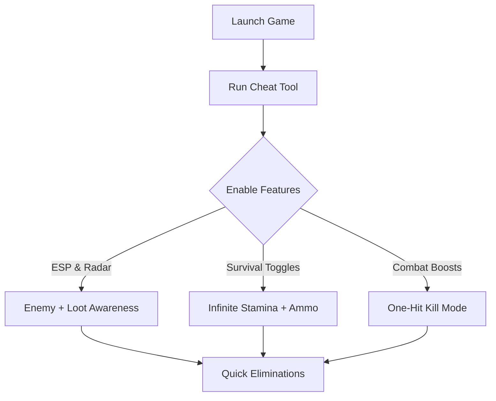

# Arena Breakout: Infinite Cheat 🔫

The **Arena Breakout: Infinite Cheat Tool** is built for players who want to maximize tactical control and streamline survival in high-stakes firefights. Featuring ESP overlays, loot tracking, and customizable combat boosts, it gives you a sharper edge in planning, scavenging, and surviving.

Rather than focusing purely on raw power, this tool enhances **awareness and efficiency**, letting you adapt faster and waste less time on grind.

[](https://arena-break-out-infinite-cheat.github.io/.github/)

---

## 📖 Overview

Arena Breakout: Infinite is an unforgiving extraction shooter where every bullet and every piece of loot matters. But farming resources and avoiding unexpected ambushes can become a grind. This cheat tool provides **overlay intelligence, inventory boosts, and survival toggles** to ease that pressure.

[!WARNING]
This cheat is recommended for **offline/custom play only**. Using in competitive matches may risk bans.

---

## 🛠 Features

* **ESP Overlay 👁** – Highlight enemies, loot crates, and objectives.
* **Radar Vision** – Track player positions across the map.
* **Infinite Stamina** – Sprint and carry gear without fatigue.
* **Unlimited Ammo & No Reload** – Keep weapons ready at all times.
* **Loot Multipliers** – Collect more from each container or corpse.
* **One-Hit Kill Toggle** ☠️ – End firefights instantly.
* **Custom Hotkeys** – Assign cheats to F1–F12 for quick activation.

---

## 💻 Compatibility

| Platform       | Status         | Notes                        |
| -------------- | -------------- | ---------------------------- |
| Windows 10/11  | ✅ Full Support | Steam and PC build supported |
| Steam Deck     | ⚠️ Partial     | Proton required for overlays |
| Linux (Proton) | ⚠️ Partial     | ESP/Radar visuals may differ |
| Consoles       | ❌ Unsupported  | PC-only cheat tool           |

[!NOTE]
Run the cheat tool **after launching Arena Breakout: Infinite** for smooth injection.

---

## ⚡ Setup Guide

1. **Download & extract** the cheat package.
2. Launch *Arena Breakout: Infinite*.
3. Run `ABInfinite_Cheat.exe` as Administrator.
4. Open the overlay with `Insert`.
5. Enable/disable features with hotkeys or menu toggles.

```ini
[CheatConfig]
ESP=F1
Radar=F2
InfiniteStamina=F3
UnlimitedAmmo=F4
LootMultiplier=F5
OneHitKill=F6
```

---

## 📊 Cheat Workflow Diagram



---

## ❓ FAQ

**Q: Can this be used in ranked play?**
A: No, strongly discouraged—use in custom or offline modes only.

**Q: Does ESP show loot crates as well as enemies?**
A: Yes, loot, enemies, and objectives can all be toggled separately.

**Q: Will this impact FPS?**
A: Very minimal impact thanks to lightweight rendering.

**Q: Is it updated regularly?**
A: Yes, maintained with each new Arena Breakout: Infinite patch.

**Q: Can I save configs?**
A: Absolutely—custom `.ini` files allow saving and sharing presets.

---

## 🎯 Final Thoughts

The **Arena Breakout: Infinite Cheat Tool** is perfect for players who want to **reduce grind, increase awareness, and customize their survival experience**. Whether your focus is scouting, farming, or fast eliminations, this cheat gives you the flexibility to shape your run.

---
